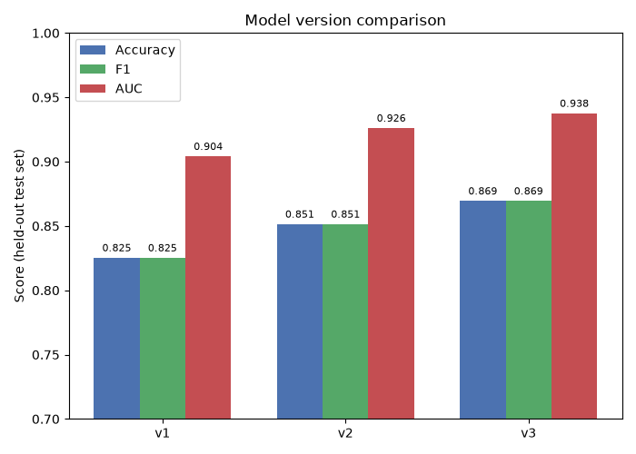
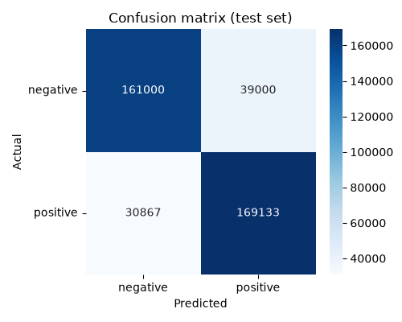
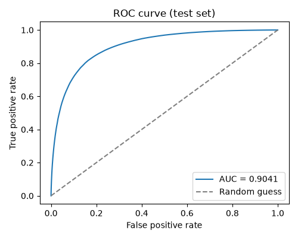
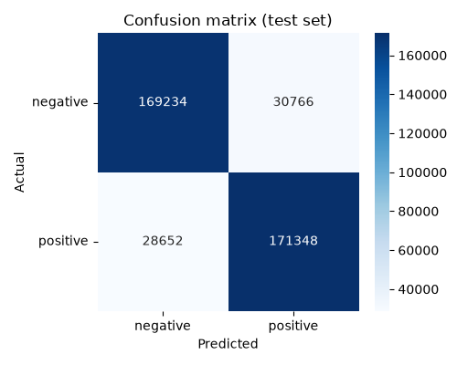

# Model Version History

Tracks what changed between registered model versions and why, plus their held-out test-set results. Metrics come from `python src/evaluate.py --version N` (writes `reports/version_N/metrics.json` + `confusion_matrix.png`/`roc_curve.png`, embedded below); the comparison chart comes from `python src/compare_versions.py --versions 1 2 3` (`reports/model_comparison.png`). All of `reports/` is committed so these images render here and stay in sync with the numbers -- regenerate them locally after retraining rather than hand-editing.

## Results (held-out test set, never used for training/tuning/validation)

| Version | Input | Sample fraction | CV folds | Best hyperparameters | Accuracy | F1 | AUC |
|---|---|---|---|---|---|---|---|
| v1 | `text` only | 5% | 5 | numFeatures=262144, regParam=0.01, elasticNetParam=0.5 | 0.8253 | 0.8253 | 0.9041 |
| v2 | `review_text` (title + body) | 5% | 5 | numFeatures=262144, regParam=0.01, elasticNetParam=0.5 | 0.8515 | 0.8515 | 0.9261 |
| v3 | `review_text` (title + body) | 10% | 3 | numFeatures=65536, regParam=0.1, elasticNetParam=0.0 | **0.8695** | **0.8695** | **0.9376** |

**Active model: v3.**

## What changed between versions, and why

### v1 -> v2: add the review title as model input
`preprocess.py` was changed to combine `title` + `text` into one `review_text` field (see `model_plan.md`), and every downstream stage (`train.py`, `predict.py`, the API) switched from tokenizing `text` alone to tokenizing `review_text`. Sample fraction (5%), CV folds (5), hyperparameter grid, and random seed were all held constant -- this was a controlled, single-variable comparison. Result: a clear, consistent improvement (accuracy +2.6pts, AUC +0.022), confirming the review title carries real, extractable sentiment signal beyond what's in the body alone.

### v2 -> v3: more training data, cheaper tuning
v3 doubled the training sample (5% -> 10% of the 3.6M-row training set) while cutting cross-validation folds from 5 to 3 (`train.py --sample-fraction 0.10 --cv-folds 3`) -- trading a noisier per-candidate estimate during hyperparameter search for the ability to fit on more data in comparable wall-clock time (v2: ~23 min for 40 fits at 5%; v3: ~13 min for 24 fits at 10%). Two things changed at once here (more data, fewer folds), unlike the clean v1->v2 comparison, so this result doesn't isolate which factor mattered more -- but the outcome was unambiguous either way: a further clear improvement (accuracy +1.8pts, AUC +0.011 over v2), and the winning hyperparameters shifted too (smaller `numFeatures`, higher `regParam`, pure L2 instead of an elastic-net mix), consistent with more training data supporting a lower-variance / more-regularized model well.

### Why the test set (not just validation) decided each promotion
Every version's validation-split numbers looked good, but the promotion decision was always confirmed against `test.parquet` -- data never touched during training, tuning, or the validation check -- via `evaluate.py --version N`, to rule out CV/validation-split optimism before changing what the API serves.

## Per-version diagnostics (test set)
`tuning_improvement.png` is intentionally not repeated here per version -- it always reflects whichever `train.py` run was most recent at the time `evaluate.py` happened to run (see its docstring), so it doesn't line up 1:1 with a specific version and would be misleading presented that way.

### v1
| Confusion matrix | ROC curve |
|---|---|
|  |  |

### v2
| Confusion matrix | ROC curve |
|---|---|
|  |  |

### v3 (active)
| Confusion matrix | ROC curve |
|---|---|
|  |  |

## Possible next steps (not done)
- Isolate the v2->v3 comparison cleanly: rerun at 10% sample with 5-fold CV (holding folds constant) to see how much of the gain is from more data vs. fewer folds.
- Try a full, un-sampled training run now that a version has a track record worth the wall-clock cost.
