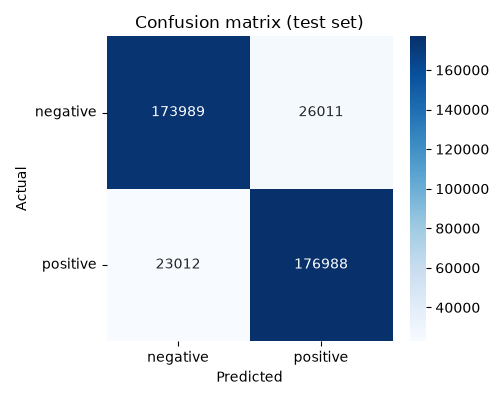
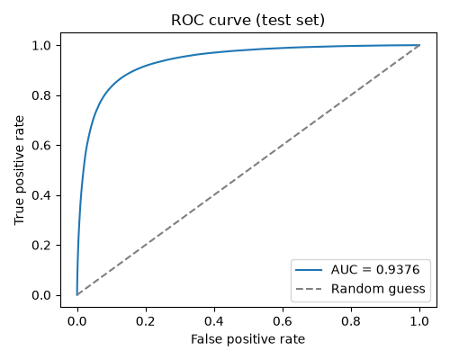

# Model Version History

What changed between each registered model version, why, and how each one scored on the held-out test set (data never used for training or tuning). The numbers below come from `python src/evaluate.py --version N`, which also writes `docs/reports/version_N/metrics.json`, `confusion_matrix.png`, and `roc_curve.png` (embedded further down). The comparison chart comes from `python src/compare_versions.py --versions 1 2 3` (`docs/reports/model_comparison.png`). All of `docs/reports/` is committed to the repo so these images stay in sync with the numbers — after retraining, regenerate them rather than editing this file by hand.

Versions v1–v3 below were tuned with a fixed 8-combination hyperparameter grid, each combination checked by k-fold cross-validation. `train.py` has since switched to an Optuna-driven search over a much wider range (`--n-trials`, see `docs/model_plan.md`) — later versions will use that instead, so a future entry's tuning description will look a little different from these. `--cv-folds` still exists, but now controls how each Optuna *trial* is scored (single split by default, or k-fold if set above 1), not a fixed grid.

## Results (held-out test set)

| Version | Input | Sample fraction | CV folds | Best hyperparameters | Accuracy | F1 | AUC |
|---|---|---|---|---|---|---|---|
| v1 | `text` only | 5% | 5 | numFeatures=262144, regParam=0.01, elasticNetParam=0.5 | 0.8253 | 0.8253 | 0.9041 |
| v2 | `review_text` (title + body) | 5% | 5 | numFeatures=262144, regParam=0.01, elasticNetParam=0.5 | 0.8515 | 0.8515 | 0.9261 |
| v3 | `review_text` (title + body) | 10% | 3 | numFeatures=65536, regParam=0.1, elasticNetParam=0.0 | **0.8695** | **0.8695** | **0.9376** |

**Active model: v3.**

## What changed between versions, and why

### v1 to v2: add the review title as model input

`preprocess.py` was changed to combine `title` and `text` into one `review_text` field (see `model_plan.md`), and every later stage — `train.py`, `predict.py`, the API — switched from reading `text` alone to reading `review_text`. Everything else (sample fraction, CV folds, hyperparameter grid, random seed) was held constant, so this was a clean, single-variable comparison. The result was a clear, consistent improvement: accuracy up 2.6 points, AUC up 0.022. This confirms the review title carries real sentiment signal beyond what's already in the body.

### v2 to v3: more training data, cheaper tuning

v3 doubled the training sample from 5% to 10% of the 3.6-million-row training set, while cutting cross-validation folds from 5 to 3 (`train.py --sample-fraction 0.10 --cv-folds 3`). That trades a noisier estimate during hyperparameter search for the ability to fit on more data in a similar amount of time — v2 took about 23 minutes for 40 model fits at 5%; v3 took about 13 minutes for 24 fits at 10%. Two things changed at once here (more data, fewer folds), so this comparison doesn't isolate which one mattered more, unlike the v1-to-v2 change above. Still, the result was unambiguous: a further improvement of 1.8 points in accuracy and 0.011 in AUC over v2, and the best hyperparameters shifted too — smaller feature count, higher regularization, pure L2 instead of a mix of L1 and L2. That's consistent with more training data supporting a simpler, more regularized model.

### Why the test set decided each promotion, not just validation

Every version looked good on its validation split, but the decision to promote a version was always confirmed against `test.parquet` — data the model never saw during training, tuning, or validation — using `evaluate.py --version N`. This rules out the possibility that a good validation score was partly luck from how that particular split happened to fall.

## Per-version diagnostics (test set)

`tuning_improvement.png` isn't repeated per version here, since it always reflects whichever `train.py` run happened to be most recent when `evaluate.py` ran — it doesn't line up cleanly with one specific version, and showing it per-version would be misleading.

### v1

| Confusion matrix | ROC curve |
|---|---|
|  |  |

### v2

| Confusion matrix | ROC curve |
|---|---|
|  |  |

### v3 (active)

| Confusion matrix | ROC curve |
|---|---|
|  |  |

## Possible next steps (not done)

- Isolate the v2-to-v3 comparison more cleanly: rerun at 10% sample with 5-fold CV (holding folds constant this time) to see how much of the gain came from more data versus fewer folds.
- Try a full, un-sampled training run now that a version has a track record worth the extra time.
